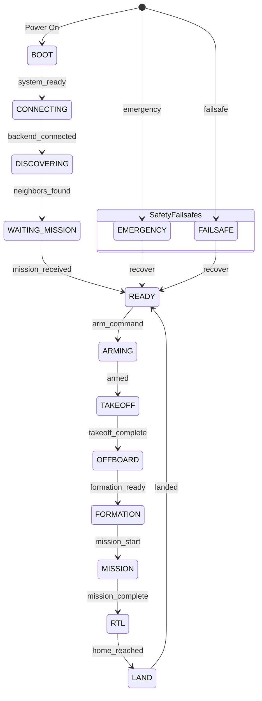
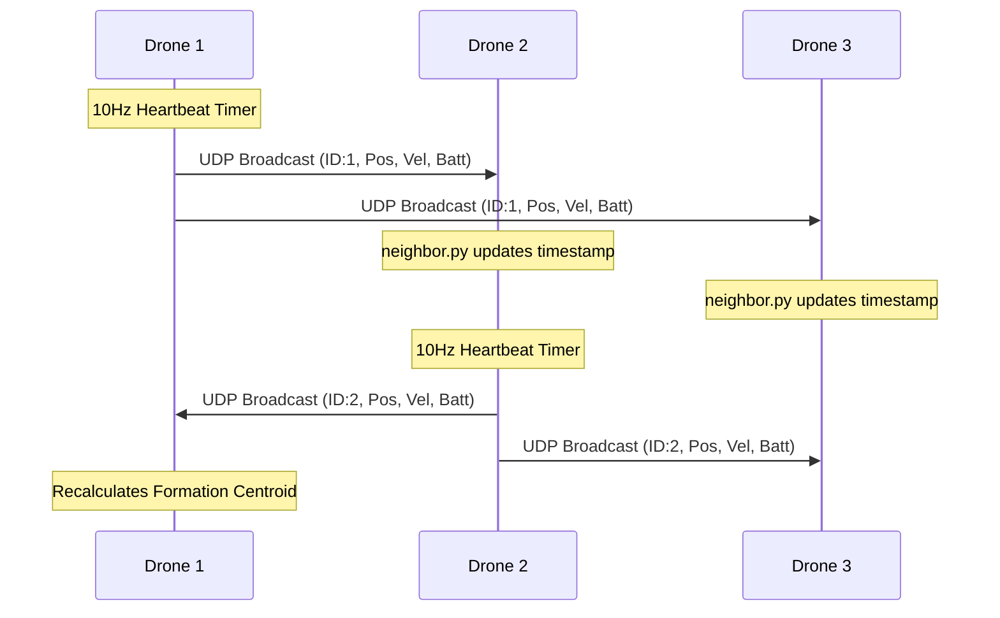

# DroneAgent System Architecture

This document provides visual diagrams of the system architecture, state transitions, and mesh communication protocols.

## System Architecture

```mermaid
graph TD
    DSOS[DSOS / Ground Control Station] <-->|WebSocket| API(FastAPI Server)
    
    API <-->|Commands/Telemetry| Main[main.py]
    
    subgraph DroneAgent Core
        Main --> StateMachine(State Machine)
        Main --> Heartbeat(Heartbeat)
        Main --> Comm(Communication UDP Mesh)
        Main --> Telem(Telemetry)
        Main --> Decision(Decision Engine)
        Main --> Move(Movement Controller)
        
        Decision <-->|Calculates Target| Formation(Formation Logic)
        Decision <-->|Mission Status| Mission(Mission Manager)
        
        Decision --> Move
    end
    
    subgraph Hardware Abstraction Layer
        Move --> Backend{Backend Factory}
        Telem <-- Backend
        StateMachine --> Backend
        
        Backend --> SITL[simulation_backend.py - UDP]
        Backend --> Real[real_backend.py - Serial]
    end
    
    SITL <-->|MAVSDK| PX4_SITL(PX4 SITL / Gazebo)
    Real <-->|MAVSDK| Pixhawk(Pixhawk 4 / Real Hardware)
    
    Comm <..>|UDP Broadcast 14560| OtherDrones(Neighbor Drones)
```

## State Machine Sequence



## Communication Sequence (Mesh UDP)


